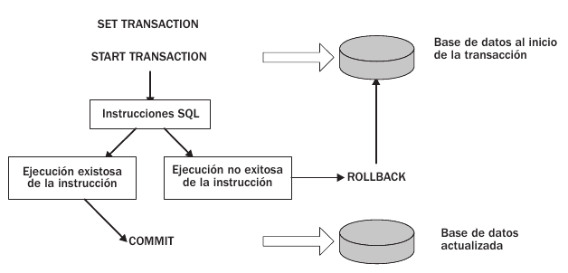

# Manejo de Transacciones


- Configuracion
- Inicio
- Aplazamiento
- Puntos de Recuperacion
- Finalizacion

## Definicion de una Transaccion

- Es el conjunto de una o mas instrucciones SQL que realizan un conjunto de acciones relacionadas
- Importante: La condicion para considerar a un conjunto de instrucciones SQL como una transaccion es el Test: A C I D

### Atomic:
        Significa Todo o Nada, se realizaran todas las operaciones o ninguna de ellas

### Concistent:
        El Estado Consistente de la Base de Datos deve permanecer asi al inicio y al final 
        de la transaccion

### Isolated:
        Aquellos datos manipulados temporalmente por la transaccion, no deven estar disponibles
        para otras transacciones hasta que su estado sea definido por la transaccion inicial

### Durable:
        Cuano la transaccion ha terminado, los cambios producidos deven ser preservados

### Importante:
Si llegara a suceder algun problema durante la transaccion, esta regresa a su punto inicial, 
restaurando los datos a su punto original

# Instrucciones de Transaccion:

- SET TRANSACTION
- START TRANSACTION
- SET CONSTRAINTS
- SAVEPOINT
- RELEASE SAVEPOINT
- ROLLBACK
- COMMIT

## Ciclo de una Transaccion



### Descripcion:
    Cuando se inicia la transacción, la base de datos se encuentra en su estado original (los datos
    son consistentes y correctos). Después se procesan las instrucciones SQL dentro de la transacción.
    Si este proceso es exitoso, se ejecuta una instrucción COMMIT. 
    
    La instrucción COMMIT provoca que la implementación SQL actualice la base de datos y finalice la transacción. 
    Si el proceso de ejecución de la instrucción no es exitoso, se ejecuta una instrucción ROLLBACK y la 
    implementación regresa la base de datos a su estado original. 
    
    Una ejecución no exitosa no significa necesariamente que las instrucciones hayan fallado. 

### Configuracion de las Propiedades de Transaccion

- SET TRANSACTION:
    - Opcional
    - La configuracion de Transaccion afectara unicamente a la proxima transaccion en ser ejecutada
    - Las Propiedades de Transaccion NO se trasladan de una transaccion a otra

### Sintaxis
```sql
SET [ LOCAL ] TRANSACTION <modo> [ { , <modo> } ... ]
```

### Arbol de Parametros


##### Ejemplo de Uso
```sql
SET TRANSACTION
 READ ONLY,
 ISOLATION LEVEL READ UNCOMMITTED,
 DIAGNOSTICS SIZE 5;

```
##### Ejemplo de Uso
```sql
SET TRANSACTION
 READ WRITE,
 ISOLATION LEVEL SERIALIZABLE,
 DIAGNOSTICS SIZE 8;

```
